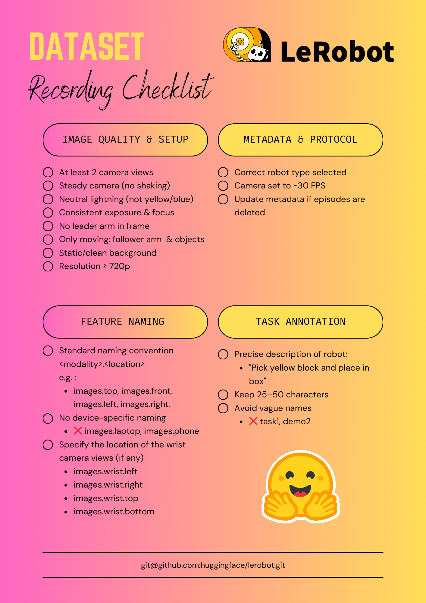

# 작업자 가이드

### 1. 상자 위치 세팅

핑크색 상자는 고정입니다. 검은색 큐브의 위치는 지정된 4개 위치를 돌아가면서 설정해주시면 됩니다.

### 2. 커맨드 입력

터미널에서 "b"하고 엔터를 입력하시면 됩니다. 카운트다운이 시작되면 바로 태스크 수행에 돌입해주세요. 60초 내에 태스크를 완료하시면 됩니다. 카운트다운이 시작하기 전에는 팔을 움직이지 않아주세요.

### 3. 팔 움직여 태스크 수행

태스크는 초록색 큐브를 집어 핑크색 상자에 넣는 것입니다.

태스크를 수행하셨으면 팔을 뒤쪽에 놓고 오른쪽 방향키 (→)를 눌러주세요.
태스크를 처음부터 다시 하고 싶으면 1. 상자 위치 세팅을 다시 하신 뒤, 왼쪽 방향키 (←)를 눌러주세요. 카운트다운이 다시 시작됩니다.

### 4. 데이터 검수 (영상 보기)

데이터 확인은 https://huggingface.co/spaces/lerobot/visualize_dataset?path=%2Fhbseong%2Frecord-pick-and-place-so101 에서 영상을 시청하시면 됩니다. 한 번 태스크를 수행하실때마다 왼쪽 사이드바에서 episode가 추가됩니다.

### 5. 데이터 시트 작성

데이터가 문제 있는지 없는지 시트에 작성해주세요. https://docs.google.com/spreadsheets/d/1SxMKX5J-EzOnh3yuTEoGQuCKU3ACvCefPLT-UERwCiw/edit?gid=0#gid=0

기록을 완료했다면 다시 1번으로 돌아가서 상자 위치 세팅부터 수행합니다.

# Commands

conda activate lerobot

sudo usermod -a -G dialout $USER # for accessing /dev/tty USB ports

sudo bash -c 'cat >/etc/udev/rules.d/99-serial-stable.rules <<EOF
SUBSYSTEM=="tty", ATTRS{idVendor}=="1a86", ATTRS{idProduct}=="55d3", ATTRS{serial}=="5AAF218212", SYMLINK+="leader"
SUBSYSTEM=="tty", ATTRS{idVendor}=="1a86", ATTRS{idProduct}=="55d3", ATTRS{serial}=="5AB9065682", SYMLINK+="follower"
EOF'

sudo udevadm control --reload-rules
sudo udevadm trigger

lerobot-calibrate \
    --robot.type=so101_follower \
    --robot.port=/dev/follower \
    --robot.id=my_awesome_follower_arm

lerobot-calibrate \
    --teleop.type=so101_leader \
    --teleop.port=/dev/leader \
    --teleop.id=my_awesome_leader_arm

lerobot-find-cameras opencv 

lerobot-teleoperate \
    --robot.type=so101_follower \
    --robot.port=/dev/follower \
    --robot.id=my_awesome_follower_arm \
    --robot.cameras="{ top: {type: opencv, index_or_path: 0, width: 640, height: 480, fps: 30 }, right: {type: opencv, index_or_path: 2, width: 640, height: 480, fps: 30 }}" \
    --teleop.type=so101_leader \
    --teleop.port=/dev/leader \
    --teleop.id=my_awesome_leader_arm \
    --display_data=true

lerobot-record \
    --robot.type=so101_follower \
    --robot.port=/dev/follower \
    --robot.id=my_awesome_follower_arm \
    --robot.cameras="{ top: {type: opencv, index_or_path: 0, width: 640, height: 480, fps: 30 }, right: {type: opencv, index_or_path: 2, width: 640, height: 480, fps: 30 }}" \
    --teleop.type=so101_leader \
    --teleop.port=/dev/leader \
    --teleop.id=my_awesome_leader_arm \
    --display_data=true \
    --dataset.repo_id=hbseong/record-pick-and-place-so101 \
    --dataset.episode_time_s=60 \
    --dataset.reset_time_s=60 \
    --dataset.num_episodes=1 \
    --dataset.single_task="Pick the black cube, and place it in the pink box." 

lerobot-record \
    --robot.type=so101_follower \
    --robot.port=/dev/follower \
    --robot.id=my_awesome_follower_arm \
    --robot.cameras="{ top: {type: opencv, index_or_path: 0, width: 640, height: 480, fps: 30 }, right: {type: opencv, index_or_path: 2, width: 640, height: 480, fps: 30 }}" \
    --teleop.type=so101_leader \
    --teleop.port=/dev/leader \
    --teleop.id=my_awesome_leader_arm \
    --display_data=true \
    --dataset.repo_id=hbseong/record-pick-and-place-so101 \
    --dataset.episode_time_s=60 \
    --dataset.reset_time_s=60 \
    --dataset.num_episodes=1 \
    --dataset.single_task="Pick the black cube, and place it in the pink box." \
    --resume=true

b() {
    # Optional extra arguments are passed via "$@"
    lerobot-record \
      --robot.type=so101_follower \
      --robot.port=/dev/follower \
      --robot.id=my_awesome_follower_arm \
      --robot.cameras='{ top: {type: opencv, index_or_path: 0, width: 640, height: 480, fps: 30 }, right: {type: opencv, index_or_path: 2, width: 640, height: 480, fps: 30 } }' \
      --teleop.type=so101_leader \
      --teleop.port=/dev/leader \
      --teleop.id=my_awesome_leader_arm \
      --display_data=true \
      --dataset.repo_id=hbseong/record-pick-and-place-so101 \
      --dataset.episode_time_s=60 \
      --dataset.reset_time_s=60 \
      --dataset.num_episodes=1 \
      --dataset.single_task='Pick the black cube, and place it in the pink box.' \
      --resume=true \
      "$@"
}

lerobot-replay \
    --robot.type=so101_follower \
    --robot.port=/dev/follower \
    --robot.id=my_awesome_follower_arm \
    --dataset.repo_id=hbseong/record-pick-and-place-so101 \
    --dataset.episode=0

# Configs

right camera : 45cm right, 27cm front from desk edge center of follower arm

top camera : 12 cm right, 9cm front, 43cm up from desk edge center of follower arm

pink box : 22cm from desk edge center of follower arm

4 designated locations of black cube

# References

### https://huggingface.co/docs/lerobot/en/il_robots#tips-for-gathering-data

Once you’re comfortable with data recording, you can create a larger dataset for training. A good starting task is grasping an object at different locations and placing it in a bin. We suggest recording at least 50 episodes, with 10 episodes per location. Keep the cameras fixed and maintain consistent grasping behavior throughout the recordings. Also make sure the object you are manipulating is visible on the camera’s. A good rule of thumb is you should be able to do the task yourself by only looking at the camera images.

### SmolVLA paper:

For the pick and place task, SmolVLA is instructed to pick up the cube and place it in the box. The box is small in size and in a fixed position while the cube starting position is varied within 5 different starting conditions. We assess completion of the task with a fine-grained score resulting in a score of 0.5 for successfully grasping the cube, and 0.5 for successfully placing it into the box.

For the stacking task, SmolVLA is required to put a cube on top of another. We instruct the robot to pick up the red cube and put it on top of the blue cube. The initial positions of both cubes vary across episodes. We assess completion of the task with a fine-grained score resulting in a score of 0.5 for successfully grasping the top cube, and 0.5 for successfully placing it on top of the bottom cube.

For the sorting tasks, which has longer horizon, SmolVLA must sort the cubes depending on the color, following the instruction to put the red cube in the right box and the blue cube in the left box. The cubes are placed in 5 different positions as in Task 1. To introduce variation, the colors of the cubes are flipped, with 5 episodes per color configuration, resulting in 10 demonstrations per position. The boxes locations remain fixed across all demonstrations. We assess completion of the task with a fine-grained score resulting in a score of 0.25 for successfully grasping either of the cubes, and 0.25 for successfully completing one cube-box matching, resulting in a score of 0.25 × 4 upon task completion. Figure 4(A) presents initial and final frames for successful episodes for all tasks, alongside the Hugging Face handle of the corresponding dataset

### https://huggingface.co/blog/lerobot-datasets#what-makes-a-good-dataset

### https://huggingface.co/datasets/lerobot/svla_so101_pickplace
dataset has only 50 episodes